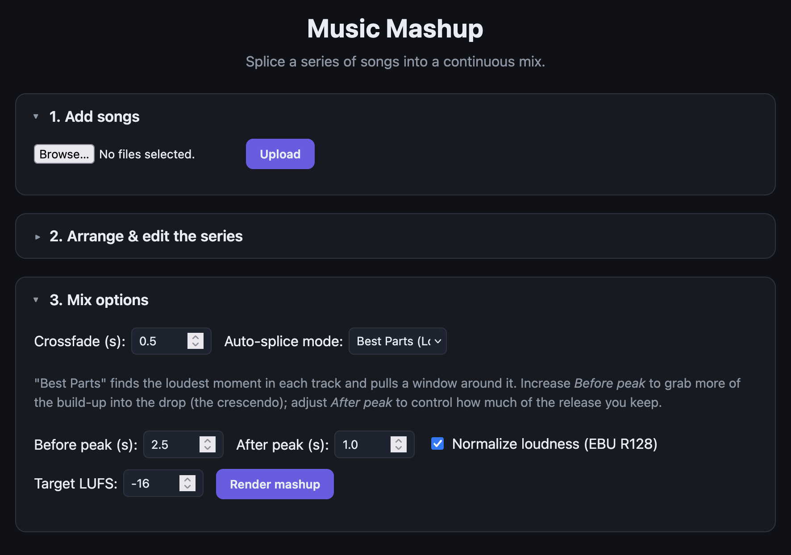

# Music Mashup

Splice a **series/collection of songs** into one continuous mix — automatically
or with exact control.

The original 2023 tool was a fixed 10-row tkinter form: pick MP3s, type
in/out minutes+seconds, append. This rewrite keeps that mission (cut each song
and combine the cuts into a final file) but makes the *collection* a first-class
object and lets the splicing be automatic:

- a **web UI** for adding, reordering, and editing a song series,
- **auto-splice "Best Parts"** (finds each track's loudest crescendo and pulls a
  window around it) or explicit in/out,
- **crossfades**, per-clip **gain/fades**, and **EBU R128 loudness normalization**,
- a **CLI** for scriptable end-to-end splicing,
- a real, passing test suite and a supported audio-format set.



## Why it moved off pydub

`pydub` depends on `audioop`, which was **removed from Python stdlib in 3.13**
(no backport). This project now targets modern Python (3.14) and uses
**numpy + soundfile** for audio I/O and **librosa** for analysis. `ffmpeg` is no
longer required for the supported formats.

## Quick start

Requires Python 3.10+.

```bash
python -m venv .venv
source .venv/bin/activate       # on Windows: .venv\Scripts\activate
pip install -r requirements.txt
python -m musicmashup            # web UI at http://127.0.0.1:8000/
```

Or use the launcher (resolves paths internally, so the spaces in the directory
name are never a problem):

```bash
./launch.sh                      # from the repo's parent directory
```

Or splice a folder from the command line:

```bash
python -m musicmashup.cli songs/ -o mix.wav --detect highlight --crossfade 0.5 --normalize
```

## Features

| Feature | How |
|---|---|
| Upload many formats | MP3, WAV, FLAC, OGG, AIFF, AU, CAF, W64, WMA, OPUS |
| Series / collection | ordered list of clips, editable + reorderable in the UI |
| Auto splice | `--detect highlight` (best/loudest part of each track) |
| Explicit control | per-clip in/out seconds, fade in/out, gain dB |
| Crossfade | equal-power crossfade between adjacent clips |
| Loudness | EBU R128 normalization to a target LUFS |
| Output | WAV (default) or other libsndfile formats by extension |

## Architecture

```
musicmashup/
  model.py     Collection/Clip dataclasses, JSON serialization
  audio.py     numpy + soundfile I/O, resampling, silence-edge trim
  analysis.py  librosa silence/BPM/beat detection (degrade gracefully)
  splice.py    engine: slice, gain/fade, crossfade, R128 normalize
  server.py    stdlib HTTP server: upload/analysis/render, serves static UI
  cli.py       scriptable CLI
  static/      web UI (HTML/CSS/JS)
  tests/       pytest suite with synthesized fixtures (no binary assets)
```

The splice engine operates purely on float32 numpy arrays, so it is fully
unit-testable without an audio backend. See `musicmashup/` for the modules.

## Where uploaded songs are stored

Uploaded audio and rendered mixes are written under `musicmashup/work/`
(`work/uploads/` and `work/outputs/`). This directory is **gitignored**, so
your songs and outputs never appear in `git status` or get pushed to GitHub.
The `.gitignore` also excludes `.venv/`, `build/`, `__pycache__/`, `.pytest_cache/`,
and `*.egg-info/` — only source code, tests, docs, and static assets are tracked.

## Tests

```bash
PYTHONPATH=.. .venv/bin/python -m pytest musicmashup/tests/ -q
```

## License

MIT — see `LICENSE`.
